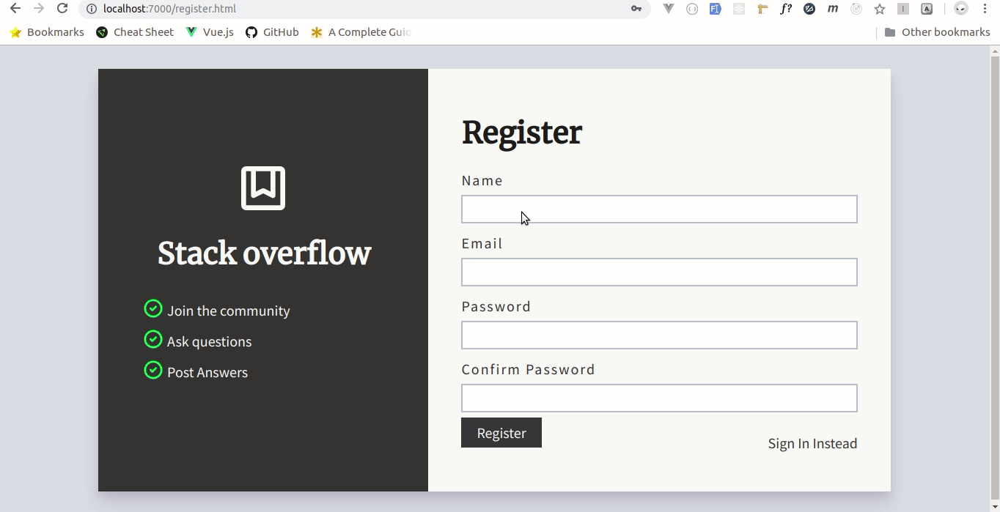

# Stack overflow lite 

[](https://codeclimate.com/github/krmroland/stackoverflow-lite-ui/maintainability)
[](https://www.codacy.com/project/krmroland/stackoverflow-lite-ui/dashboard?utm_source=github.com&amp;utm_medium=referral&amp;utm_content=krmroland/stackoverflow-lite-ui&amp;utm_campaign=Badge_Grade_Dashboard)

| Service         | Master        | Develop    |
| -------------   |-------------|----------|
|Travis CI status | [](https://travis-ci.org/krmroland/stackoverflow-lite-ui)|[](https://travis-ci.org/krmroland/stackoverflow-lite-ui)|
|Coveralls|[](https://coveralls.io/github/krmroland/stackoverflow-lite-ui)|[](https://coveralls.io/github/krmroland/stackoverflow-lite-ui?branch=develop)|


StackOverflow-lite-ui  is a platform where people can ask questions and provide answers.
# Getting Started
In your terminal 
1. Clone the repo locally to your machine by running `git clone https://github.com/krmroland/stackoverflow-lite-ui`
2. change your current directory (`cd`) to wherever you cloned the app in 1 above.

# UI

#### Demo
A working demo is hosted [here](https://krmroland.github.io/stackoverflow-lite-ui/)



##### Features
- Users can create an account and log in.
- Users can post questions.
- Users can delete the questions they post.
- Users can post answers.
- Users can view the answers to questions.
- Users can search for questions on the platform
- Users can view the answers to questions.

#### Developer Notes

UI template development uses the following tools;
- [Handlebars](https://handlebarsjs.com/) templates for code modularity and re-usability which are then compiled down to plain html
- [Sass](https://sass-lang.com/)  a CSS preprocessor, which adds special features such as variables, nested rules and mixins that makes CSS development enjoyable
- [webpack](https://webpack.js.org/) for module bundling and  with the help of [loaders](https://webpack.js.org/loaders/) , it is able to process do the following;
    - Compile **Sass** to **CSS**
    - Compile Handlebar templates **(.hbs)** to **html**
    - Trans-pile **Es6** Javascript to **ES5**
    - Remove **Unused css selectors**  from final build keeping the bundle size minimal
    - Live reloading, with [browser-sync](https://browsersync.io/) that makes local development enjoyable
    - Prettify the generated html before it is saved
    - Uglify and minimize both **CSS** and **JavaScript** in production to reduce bundle sizes
 
 
 _Do not make any changes in  the  `UI/dist` folders since the directory will be cleaned on every application build_


#### Requiremens
Ensure that you have the following tools available locally on your machine

-   [Node js](https://nodejs.org/en/), a JavaScript runtime built on Chrome's V8 JavaScript engine.
-   [A package manager](https://en.wikipedia.org/wiki/Package_manager) ([npm](https://www.npmjs.com/) or [yarn](https://yarnpkg.com/lang/en/)) for installing  **webpack** and its dependencies
-   [Git](https://git-scm.com/) , a Version Control System

#### Setup
While in the project root `cd into the ui` directory

#### Install Dependencies
While still in the terminal run `npm install` or  `yarn` depending on which package manager you have installed .

#### Building the UI templates
While in the terminal in the `UI` directory
 1. `npm run build` or `yarn run production ` to compile `.hbs` ,`css`,`js`, and images
 2. `npm run production` or `yarn run production` to compile `.hbs`  ,`css`,`js`,`images` and minify them
 3. `npm run watch` or `yarn run watch` to set up a local development server and watch all the files for changes and live reload

# API
#### This __api__ is currently hosted on [heroku](https://andela-stackoverflow-v1.herokuapp.com/api/v1.0/)
#### Requirements
- [Python](https://www.python.org/) A general purpose programming language
- [Pip](https://pypi.org/project/pip/) A tool for installing python packages
- [Virtualenv](https://virtualenv.pypa.io/en/stable/)  A tool to create isolated Python environments

#### Development setup
- Create a virtual environment and activate it
    ```bash
     virtualenv venv
     source /venv/bin/activate
    ```
- Install dependencies 
    ```bash
    pip3 install requirements.txt
    ```
- Run the application
    ```bash
    export FLASK_ENV=development
    python run.py
    ```

#### Running tests
```bash
pytest
#with coverage
pytest pytest   -v --cov api
```
#### API REST End Points
| End Point                                           | Verb |Use                                   |
| ----------------------------------------------------|------|--------------------------------------|
|`/api/v1.0/`                                         |GET   |API index                             |
|`/api/v1.0/questions`                                |GET   |Gets a list of Questions              |
|`/api/v1.0/questions`                                |POST  |Stores a Question resource            |
|`/api/v1.0/questions/<int:id>`                       |GET   |Gets a Question resource of a given ID|
|`/api/v1.0/questions/<int:id> `                      |PATCH |Updates a Question resource           |
|`/api/v1.0/questions<int:id>`                        |DELETE|Deletes a Question resource           |
|`/api/v1.0/questions/<int:id>/answers`               |GET   |Gets a answers of a specific question |
|`/api/v1.0/questions/<int:id>/answers`               |POST  |Adds a an answer to a question        |
|`/api/v1.0/questions/<int:id>/answers/<int:id>`      |GET   |Gets a specific answer                |
|`/api/v1.0/questions/<int:id>/answers/<int:id>`      |UPDATE|Updates an existing answer            |
|`/api/v1.0/questions/<int:id>/answers/<int:id>`      |DELETE|Deletes an existing answer            |

#### Built With
- [Flask](http://flask.pocoo.org/) A microframework for Python based on Werkzeug, Jinja 2 

## Acknowledgments
 A Special thanks goes to 
1. [Andela](https://andela.com/) for having given me an opportunity to participate in the boot camp, without them , this application wouldn't be a success.

2. [UI Faces](https://uifaces.co/) for providing free avatar sources that I used in the UI templates